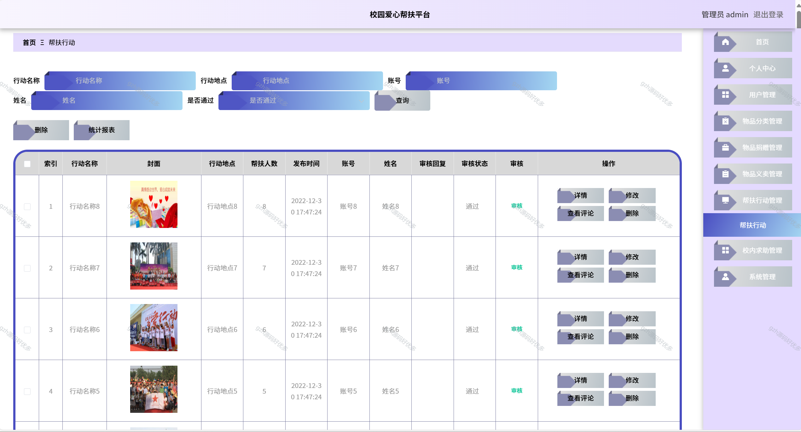

# python104
python104基于Python+Django的校园爱心帮扶平台系统
 
## 查看主页获取源码

### 一、关键词
校园爱心援助平台系统，校园帮扶互助平台系统，校园公益互助平台系统

### 二、作品包含
源码+数据库+全套环境和工具资源+本地部署教程

### 三、项目技术
前端技术：Vue2.0、Element-ui
后端技术：Python3.7、Django2.0

### 四、运行环境（以下版本亲测，其他版本兼容性请自行测试）
开发工具：PyCharm + VSCODE

数据库：MySQL5.7（最低要5.7版本）

数据库管理工具：Navicat10+

Python：Python3.7

前端Nodejs：14

浏览器：谷歌浏览器

### 五、项目介绍
项目编号：python0104

校园爱心帮扶平台系统能精准对接学生的帮扶需求与校内外爱心资源，既为有困难的学生提供学业、生活等方面的切实帮助，也为爱心人士或组织搭建便捷的奉献渠道，促进校园公益高效开展。
校园爱心帮扶平台功能丰富，可进行物品捐赠，便于师生捐赠闲置物品；支持物品义卖，助力爱心物资变现；开展帮扶行动，组织公益帮扶活动；提供校内求助通道，帮有需要的人发布需求；还有爱心资讯传播及后台管理，用于审核、统计各类信息 。

### 六、运行截图

